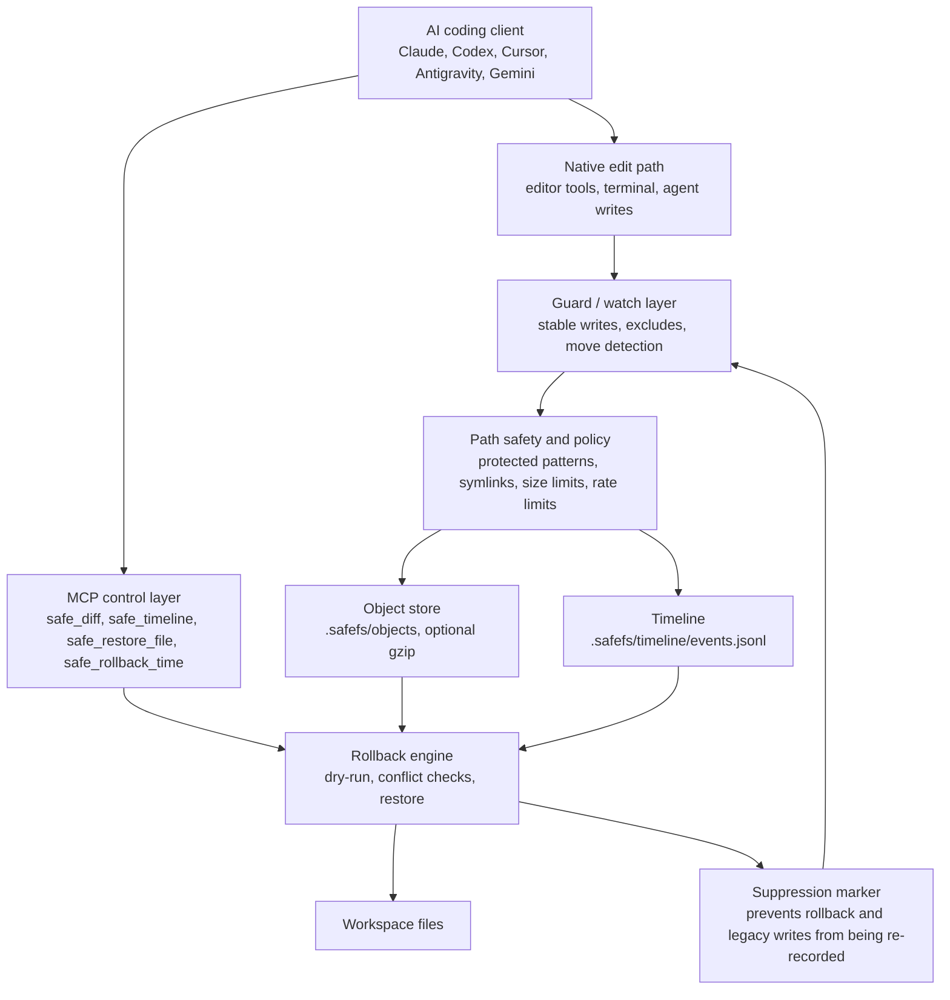

<p align="center">
  
</p>

# SafeFS MCP

[](https://www.npmjs.com/package/@tekergul/safefs-mcp)
[](https://github.com/TEKERGUL/safefs-mcp/actions/workflows/ci.yml)
[](LICENSE)
[](package.json)

AI broke your code? Roll back the last 10 minutes.

SafeFS is a lightweight session guard for AI coding agents. It records local before-change snapshots while Claude Code, Codex, Cursor, Antigravity, Gemini CLI, editors, or terminals make normal native file edits. No Git commit, Docker daemon, database, or network service is required.

SafeFS is still an MCP server, but the recommended workflow is guard-first: the watcher records native edits in the background, while MCP tools handle diff, timeline, storage status, and rollback.

## Why SafeFS

AI coding tools are fast, but one bad refactor can spread across many files before you notice. Git helps when you remembered to commit. SafeFS covers the gap between "I just asked the agent to try something" and "I am sure I want to keep this."

- Start an AI session with lightweight protection
- Let agents use their normal edit tools
- Preview what changed in the last `10m`, `1h`, or `1d`
- Roll back only the risky session window without resetting the whole repo
- Keep secrets, `.git`, `.safefs`, vendor folders, build output, binary files, and large files out of snapshots by default

## Quick Start

Install once:

```bash
npm install -g @tekergul/safefs-mcp
```

Upgrade later:

```bash
npm install -g @tekergul/safefs-mcp@latest
```

Initialize a project:

```powershell
safefs init --yes --clients claude --auto-guard
Invoke-Expression (safefs auto-guard env powershell)
claude
```

Bash/zsh:

```bash
safefs init --yes --clients claude --auto-guard
eval "$(safefs auto-guard env bash)"
claude
```

After activation, run your agent normally. The project-local wrapper starts SafeFS guard in the background.

Preview and apply recovery:

```bash
safefs diff 10m
safefs rollback 10m
safefs rollback 10m --yes
```

Rollback defaults to dry-run. Use `--yes` only after reviewing the plan or diff.

## 30-Second Demo Flow

```bash
npm install -g @tekergul/safefs-mcp
safefs init --yes --clients claude --auto-guard
eval "$(safefs auto-guard env bash)"
claude
```

Ask the agent to improve a small app. Then ask for a risky refactor. When the result breaks:

```bash
safefs diff 10m
safefs rollback 10m --yes
```

SafeFS restores the pre-change state for the affected files while leaving unrelated project files alone.

## Features

- Works when agents use native edit tools through guard/watch or project-local auto-guard
- Roll back AI changes from `10m`, `15m`, `1h`, `3h`, `1d`, `7d`, or an ISO timestamp
- Preview rollback as readable unified diffs before applying changes
- Restore one file without resetting the whole project
- Skip conflicts when files changed after the recorded edit
- Ignore protected paths, secrets, vendor folders, build output, binary files, and large files by default
- Cache watch state in a local manifest for large projects
- Detect stable writes, common temp files, case collisions, symlinks, and same-hash moves
- Defer large bursts instead of dropping watcher events
- Report project storage health with `safefs checkup`
- Support Claude Code, Codex, Cursor, Antigravity, Gemini CLI, Roo Code, Cline, and other MCP clients

## Install Modes

| Mode | Command | Best for |
| --- | --- | --- |
| Auto-guard | `safefs init --yes --clients claude --auto-guard` | Everyday AI sessions with minimal typing |
| Manual guard | `safefs guard -- claude` | One-off protected sessions |
| Watch | `safefs watch` | A separate terminal watching all local edits |
| MCP only | `safefs serve --root .` | Clients that only need recovery/status tools |

Auto-guard is project-local. It creates wrappers under `.safefs/bin` and activation scripts under `.safefs/`, but it does not edit global shell profiles or hijack global binaries.

## CLI

```bash
safefs init
safefs doctor
safefs guard -- claude
safefs auto-guard install --clients claude,codex
safefs auto-guard status
safefs auto-guard env powershell
safefs auto-guard uninstall
safefs mcp-config antigravity
safefs watch
safefs watch --dry-run
safefs timeline --since 3h
safefs diff 10m
safefs diff --since 10m
safefs rollback 10m
safefs rollback 10m --yes
safefs storage
safefs checkup
safefs checkup --strict
safefs prune --days 30
safefs prune --days 30 --yes --gc
safefs gc
safefs gc --yes
```

Maintenance commands also default to dry-run. `checkup` reports storage and watcher health without deleting anything. `prune` removes old timeline events and `gc` removes unreferenced objects only when `--yes` is provided.

## Auto-Guard, Guard, And Watch Mode

`auto-guard` is the easiest everyday setup. It installs project-local wrappers in `.safefs/bin` and does not modify global shell profiles or global binaries:

```bash
safefs init --yes --clients claude,codex --auto-guard
safefs auto-guard status
```

Activate the current shell, then run your agent normally:

```powershell
Invoke-Expression (safefs auto-guard env powershell)
claude
```

If `safefs doctor` says PATH is not active, run the activation command again in the same terminal where you will launch the agent.

Manual `guard` remains available for explicit sessions:

```bash
safefs guard -- claude
safefs guard -- codex
```

`guard` starts SafeFS watch, runs the command, captures native file writes/deletes/moves, and flushes the final changes when the command exits.

Use `watch` when you want a separate terminal:

```bash
safefs watch
```

Watch mode respects `.gitignore`, protected patterns, file-size limits, stable-write debounce, binary detection, case-collision safety, symlink policy, move detection, per-cycle rate limits, and `.safefs/watch/manifest.json` reuse.

## Supported Clients

| Client | MCP config | Auto-guard wrapper | Notes |
| --- | --- | --- | --- |
| Claude Code | Yes | Yes | Recommended demo path |
| Codex | Yes | Yes | Use SafeFS MCP tools for inspection/recovery |
| Cursor | Yes | Yes | MCP config snippet is generated by init |
| Antigravity | Snippet | Watch-first | Use `safefs mcp-config antigravity`, then run `safefs watch` |
| Gemini CLI | Yes | Yes | Tool names may be alias-prefixed |
| Roo Code / Cline | Manual example | Watch/guard compatible | Use standard MCP server config |
| Other editors / terminals | No generated config | Watch/guard compatible | Use `safefs watch` or `safefs guard -- <command>` |

## MCP Tools

SafeFS remains an MCP server. The watcher/auto-guard layer captures native edits; MCP tools provide recovery and inspection:

- `safe_read_file`
- `safe_diff`
- `safe_timeline`
- `safe_restore_file`
- `safe_rollback_time`
- `safe_storage_status`

Legacy write tools remain for compatibility but are no longer the recommended path:

- `safe_write`
- `safe_patch`
- `safe_delete`

Gemini CLI qualifies MCP tool names with the server alias, so SafeFS tools may appear as names like `mcp_safefs_safe_diff`.

## How Rollback Works

1. Guard/watch builds or reuses a local baseline manifest.
2. Native file changes become stable after the debounce window.
3. SafeFS stores before/after content in `.safefs/objects/` and appends committed timeline events.
4. Rollback groups committed events by file, validates current hashes, checks conflicts, and restores the earliest before-change state.
5. Rollback writes a short suppression marker so the watcher does not record rollback itself as a new agent edit.

If a file changed after the recorded edit, rollback skips it and reports the expected/current hashes.

## Example Recovery Session

```bash
# See what SafeFS can restore from the last 10 minutes.
safefs diff 10m

# Preview rollback without touching files.
safefs rollback 10m

# Apply the rollback after review.
safefs rollback 10m --yes
```

Typical dry-run output separates restored files, created files that would be deleted, conflicts, and skipped files. Conflict reports include expected and current hashes so you can decide whether to keep manual edits, inspect the diff, or retry with a narrower path.

For a single damaged file, MCP clients can use `safe_restore_file` instead of rolling back the whole time window:

```json
{
  "path": "src/utils.ts",
  "dryRun": true
}
```

`checkpointId` is optional. If omitted, SafeFS restores from the latest committed checkpoint for that file. Applying still requires `dryRun: false` and `confirm: true`.

## Security Model

- Paths must stay inside the workspace root
- `.git/`, `.safefs/`, `.env*`, keys, tokens, cloud credentials, secrets, and common build/vendor folders are protected by default
- User config can add protected patterns and watch excludes
- Symlinks are skipped by default; symlink escapes are blocked when following is enabled
- Binary and large files are skipped by watch mode
- Timeline events are append-only
- Timeline pruning and object garbage collection are explicit, dry-run-first maintenance commands

See [SECURITY.md](SECURITY.md).

## Storage And Privacy

SafeFS stores snapshots inside the project-local `.safefs/` directory. It does not upload source code, send file contents to a server, or require a background cloud service.

Default watch rules avoid:

- `.git/`, `.safefs/`, `.env*`, credentials, keys, and token-like files
- `node_modules/`, `dist/`, `build/`, caches, and package-manager stores
- binary files, very large files, and temporary editor files
- symlink escapes outside the workspace root

You can inspect local storage with:

```bash
safefs checkup
safefs storage
safefs prune --days 30
safefs prune --days 30 --yes --gc
safefs gc --yes
safefs timeline --since 1h
```

`safefs storage` and `safefs checkup` use the same warning engine. They warn when the timeline file, object store, or oldest event crosses configured thresholds, but they do not prune or delete files automatically.

Object compression is optional:

```yaml
storage:
  objectCompression: true
```

When enabled, SafeFS compresses newly written objects with gzip while keeping hashes based on the original decompressed bytes. Existing raw objects remain readable and are not migrated or rewritten.

## Binary File Policy

SafeFS focuses on text-oriented AI coding sessions.

- Watch mode skips binary files by default and reports the skip reason as `binary_file_skipped`
- `safefs watch --dry-run` shows binary skip counts separately from other skipped files
- Unified diff output does not attempt text diffs for binary content; binary diffs are marked as binary
- Legacy write tools are text-oriented compatibility tools
- The object store can roundtrip raw bytes, but watch mode keeps the safer default of skipping binary files

## Client Configuration

The recommended setup command writes project-local config snippets for selected clients:

```bash
safefs init --yes --clients codex,cursor,claude,gemini,antigravity --auto-guard
```

Manual examples live in [examples/](examples/).

### Antigravity

Antigravity uses a global/shared MCP config file. SafeFS does not modify it automatically.

Generate the SafeFS snippet from the project root:

```bash
safefs init --yes --clients antigravity
safefs mcp-config antigravity
```

Paste the output into Antigravity's raw MCP config at `~/.gemini/config/mcp_config.json`, then start watch mode before opening or using Antigravity:

```bash
safefs doctor --antigravity
safefs watch
```

The generated snippet uses an absolute `--root` path because Antigravity's global config is not project-local.

### Gemini CLI

Project config path: `.gemini/settings.json`

```json
{
  "mcpServers": {
    "safefs": {
      "command": "npx",
      "args": ["-y", "@tekergul/safefs-mcp", "serve", "--root", "."],
      "timeout": 600000,
      "trust": false
    }
  }
}
```

To verify that Gemini can see the project config:

```bash
safefs doctor --gemini-smoke
```

### Claude Code / Cursor

Use an `mcpServers` JSON object:

```json
{
  "mcpServers": {
    "safefs": {
      "type": "stdio",
      "command": "npx",
      "args": ["-y", "@tekergul/safefs-mcp", "serve", "--root", "."],
      "env": {}
    }
  }
}
```

### Codex

```toml
[mcp_servers.safefs]
enabled = true
command = "npx"
args = ["-y", "@tekergul/safefs-mcp", "serve", "--root", "."]
startup_timeout_sec = 10
tool_timeout_sec = 60
default_tools_approval_mode = "prompt"
enabled_tools = [
  "safe_read_file",
  "safe_diff",
  "safe_timeline",
  "safe_restore_file",
  "safe_rollback_time",
  "safe_storage_status"
]
```

## Limitations

- Directory deletion is intentionally blocked
- Function-level and exact line-range rollback are planned for later releases
- Object compression is opt-in and applies to new objects only; existing raw objects are not migrated
- Auto-guard is opt-in per project; SafeFS does not modify global shell startup files
- SafeFS complements Git; it does not replace commits, branches, or backups

## Architecture

SafeFS is built as three cooperating layers: an MCP control layer, a native edit watcher, and a rollback engine.



### Data Flow

1. `auto-guard`, `guard`, or `watch` starts a lightweight watcher for the workspace.
2. The agent edits files normally. SafeFS does not require the agent to call legacy write tools.
3. Watch mode waits for writes to become stable, filters unsafe paths, and stores content-addressed objects.
4. Large bursts are recorded up to the per-cycle limit; remaining stable changes stay pending for the next cycle.
5. Timeline events record committed file changes, including write, delete, and move operations.
6. `safe_diff` and `safefs diff` compute what rollback would restore.
7. `safe_restore_file` restores one selected file from a checkpoint without touching unrelated files.
8. `safe_rollback_time` and `safefs rollback` validate current hashes before changing files.
9. Rollback suppression prevents SafeFS from recording its own restore operation as a fresh edit.

### Design Principles

- Guard native edits instead of trusting every agent to choose the right write tool
- Prefer dry-run-first recovery over destructive automation
- Keep project data local and inspectable
- Protect secrets and workspace internals even if user config is permissive
- Stay lightweight enough for real repositories, not just demos

## Development

```bash
pnpm install
pnpm lint
pnpm test
pnpm build
npm pack --dry-run
```

## Release Checklist

1. Confirm `pnpm audit`, `pnpm lint`, `pnpm test`, `pnpm build`, `npm pack --dry-run`, and `node dist/cli.js --help` pass locally.
2. Run a clean-project smoke test: global install, `safefs init --yes --clients claude --auto-guard`, shell activation, wrapper launch, `safefs diff 10m`, and rollback dry-run.
3. Push and wait for GitHub Actions to go green.
4. Publish with `npm publish --access public`.
5. Verify npm with `npm view @tekergul/safefs-mcp version` and `safefs doctor --online`.
6. Create a GitHub release with 1.2 notes; demo GIF/logo polish can follow after the release.

## License

MIT
